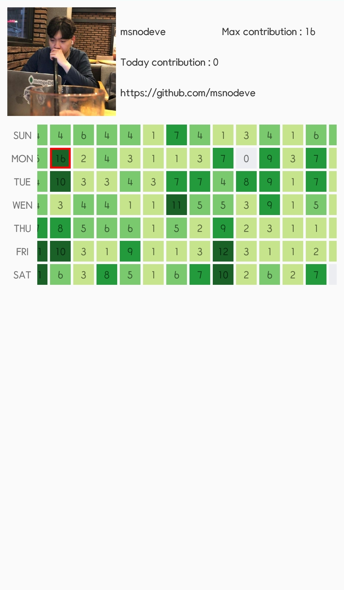

# Github For Developer

***

# Release
v0.6.2 릴리즈 [Google Play Store](https://play.google.com/store/apps/details?id=com.seok.gitfordeveloper)

# Preview

# Notice

v0.6.2 릴리즈 작업 완료
- Backend 작업
- UX/UI 개선 작업
- 자동 로그인 구현

유저들과 서로 소통할 수 있기 위한 Backend 작업 중
