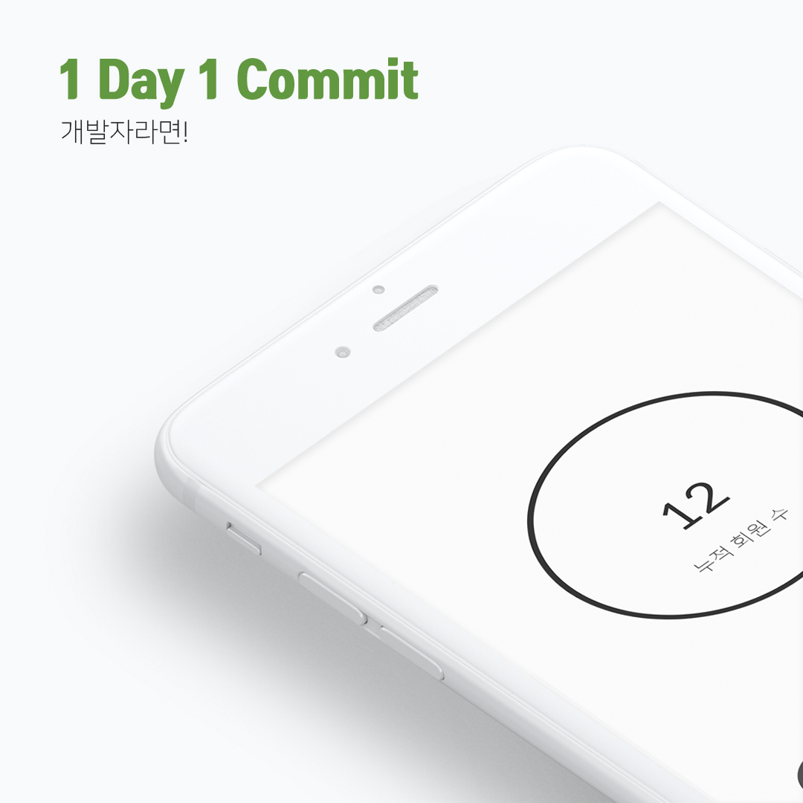
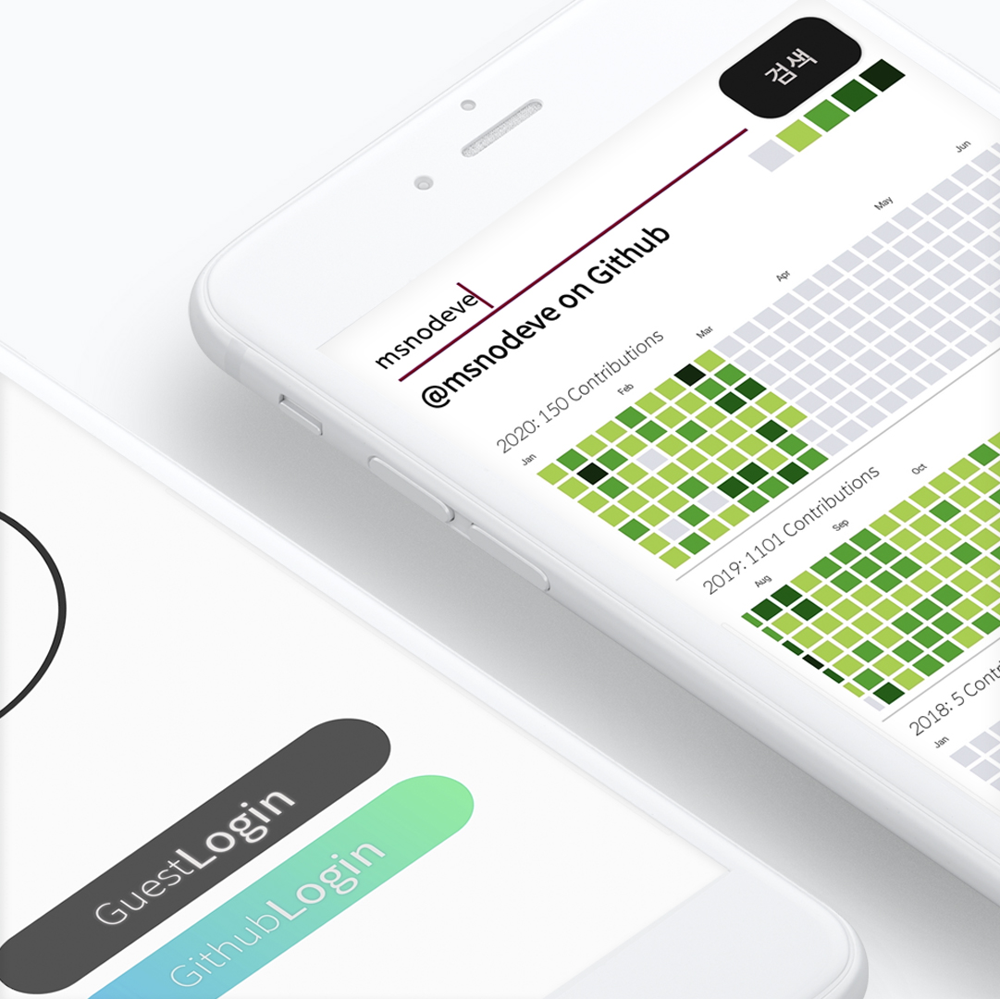
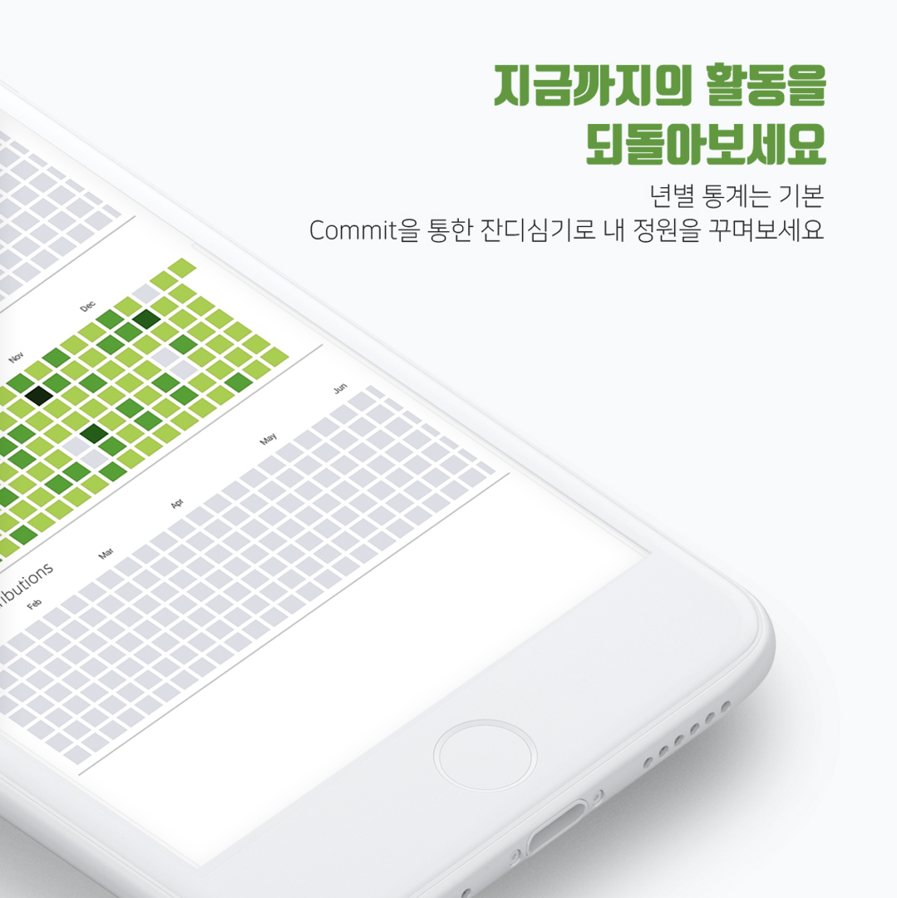

# Github For Developer

***
  

# Release

v3.4.3 릴리즈 [Google Paly Store](https://play.google.com/store/apps/details?id=com.seok.gfd)

  

# Preview

  

# Notice

v1.6.2 릴리즈 작업 완료

- Backend 작업
- UX/UI 개선 작업
- 자동 로그인 구현

v2.4.1 릴리즈 작업 완료

- 금일 커밋 랭킹 서비스 구축
- 프로필, 랭킹 프래그먼트로 분리

v2.10.4 릴리즈 작업 완료

- 대대적인 UI/UX 개선
- 도움을 주신 분 탭 추가
- 앱 성능 최적화

v2.11.1

- Github Contribution 그래프 UI 변경
- 랭킹 서비스 오류로 인해 수정 진행 중

v3.4.3

- Guest 사용자 서비스
- UI 추가